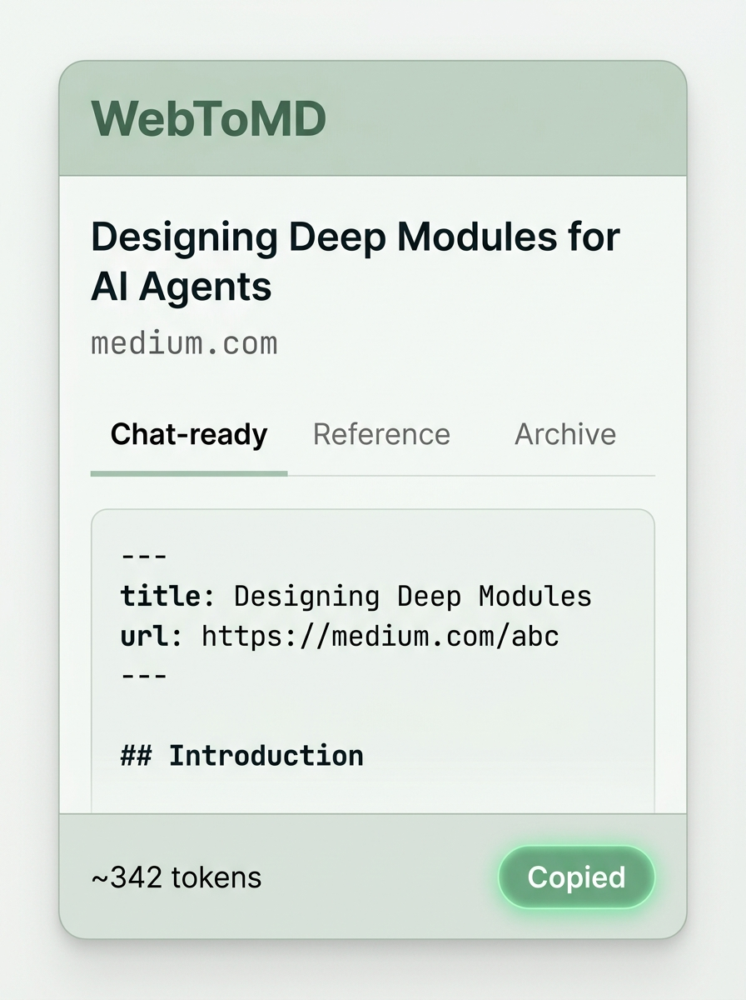

# WebToMD 📄➡️✍️

WebToMD is a lightweight, Manifest V3 Chrome extension designed to extract the main content of
any webpage or text selection as token-efficient Markdown — optimized for pasting into AI agent
and LLM contexts.

---



---

## Features

- 🧠 **Content-Aware Extraction**: Uses Mozilla's Readability algorithm to extract the core article body, filtering out noisy sidebars, navigation bars, headers, footers, ads, and widgets.
- ⚡ **Three Formatting Presets**:
  - **Chat-ready**: Strips both images and links. This delivers the cleanest and most token-efficient output for standard LLM chat prompts.
  - **Reference**: Strips images but keeps inline links, allowing the AI agent to cite sources and verify information.
  - **Archive**: Retains both image URLs and inline links, ideal for saving clips into your personal knowledge base or markdown notebook.
- 💬 **Zero-UI Selection Clipping**: Select any snippet of text on a page, right-click, and select "Copy as MD" from the context menu to copy it directly with custom formatting.
- 🔢 **Token Count Estimator**: Displays a real-time token count estimation in the extension popup, letting you choose the perfect preset to manage your context windows.
- 🔒 **Privacy First**: Built using Chrome's `activeTab` permission. It only accesses the active page when you explicitly invoke it, requiring no persistent background host permissions.

---

## Technologies Used

WebToMD is built with a modern, high-performance web development stack:

- **[WXT](https://wxt.dev/)**: Next-gen framework for building cross-browser web extensions.
- **[Svelte 5](https://svelte.dev/)**: Reactive UI framework for the sleek, light popup.
- **[TypeScript](https://www.typescriptlang.org/)**: For robust type-safe codebase.
- **[@mozilla/readability](https://github.com/mozilla/readability)**: The core parser for page content extraction.
- **[Turndown](https://github.com/mixmark-io/turndown)**: An extensible HTML-to-Markdown converter.
- **[Vitest](https://vitest.dev/)**: Fast unit and integration testing.

---

## Installation

To install WebToMD locally as an unpacked extension:

1. **Clone the Repository**:

   ```bash
   git clone https://github.com/ramaaudra/web-to-markdown.git
   cd web-to-markdown
   ```

2. **Install Dependencies**:
   Ensure you have [Bun](https://bun.sh/) installed:

   ```bash
   bun install
   ```

3. **Run the Development Server**:

   ```bash
   bun dev
   ```

   This will start the WXT development server with Hot Module Replacement (HMR) and compile the extension to `.output/chrome-mv3/`.

4. **Load the Extension in Chrome**:
   - Open Chrome and navigate to `chrome://extensions/`.
   - Toggle **Developer mode** in the top-right corner.
   - Click the **Load unpacked** button.
   - Select the `.output/chrome-mv3` folder inside this project directory.

---

## Usage

### Full Page Clip

1. Navigate to the webpage you want to clip.
2. Click the **WebToMD** extension icon in your toolbar.
3. Select your desired preset: **Chat-ready**, **Reference**, or **Archive**.
4. The Markdown is automatically copied to your clipboard, and you can see a preview and token count in the popup window.

### Selection Clip

1. Highlight any portion of text on a page.
2. Right-click the highlighted text.
3. Select **Copy as MD** from the context menu.
4. A toast notification will appear confirming that the Markdown selection has been copied to your clipboard.

---

## Contributing

Contributions are welcome! Please follow these guidelines:

1. Fork this repository.
2. Create a feature branch: `git checkout -b feature/your-feature`.
3. Ensure typechecking and formatting pass by running:
   ```bash
   bun compile
   ```
4. Submit a Pull Request describing your changes.

---

## License

TBD — Please refer to the [ADR backlog](docs/adr/) for architectural decisions and licensing plans.

---

## Acknowledgments

- [Mozilla Readability](https://github.com/mozilla/readability) for the excellent DOM parsing engine.
- [Turndown](https://github.com/mixmark-io/turndown) for HTML-to-Markdown conversions.
- Shaun Fulton for the inspiration behind the [README layout](https://medium.com/@fulton_shaun/readme-rules-structure-style-and-pro-tips-faea5eb5d252).
